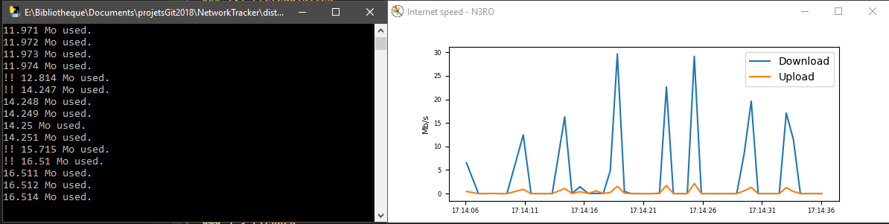

# Bandwidth monitor

 

A simple python bandwidth monitor (upload / download).

## 1. Getting started
### 1.1 Prerequisites
- [psutil](https://psutil.readthedocs.io/en/latest/index.html?highlight=net_io_counters)

### 1.2 How to use it
Run `python main.py`.

### 1.3 Setting up your dev environment
Open the folder with your favorite code editor, and the job is done. Run `pyinstaller bandwidth_monitor.spec` to generate an executable.

## 2. Miscellaneous
### 2.1 Changelog
The changelog is available [here](CHANGELOG.md).

### 2.2 Authors
- **N3ROO** - *Initial work* - [Github](https://github.com/N3ROO) [Website](https://n3roo.github.io/)

### 2.3 License
This project is licensed under the MIT license - see the [LICENSE](LICENSE) file for details